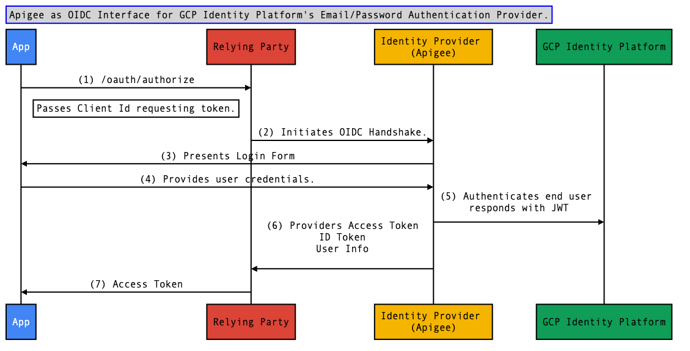
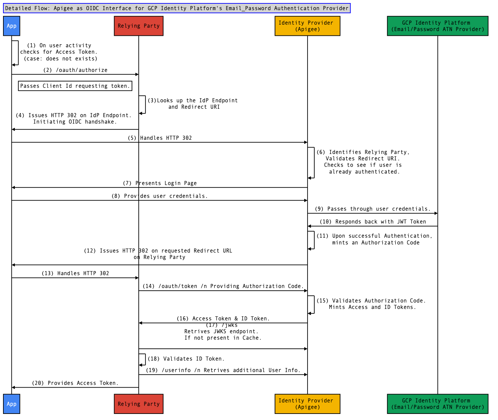

# Apigee as OIDC Interface for [CICP](https://cloud.google.com/blog/products/identity-security/simplifying-identity-and-access-management-for-more-businesses)

The solution is based on this Reference Architecture: 
["Apigee as standards based authentication Interface for an existing Identity Store"](https://github.com/nas-hub/Apigee-Enterprise-Security-Design-Patterns/tree/master/IAM-Integration/IdentityStore-Pattern). 

This is a fully deployable solution, follow instructions [below](https://github.com/nas-hub/apigee-as-oidc-interface-for-cicp#pre-requisites) to install this solution on your Apigee Org.

## Solution Architecture: 

### Architecture Modules

**1. GCP Cloud Identity - Email/Password based Authentication Provider** :

[GCP Identity Platform](https://cloud.google.com/blog/products/identity-security/simplifying-identity-and-access-management-for-more-businesses) provides various Authentication Providers, one such provider is for Email/Password based authentication.  This provider has a REST endpoint for authenticating end users based on Email/Password. The service authenticates end user  and returns a JWT upon successful authentication. More information on this [here](https://firebase.google.com/docs/auth/web/password-auth).

**2. OIDC Identity Provider Service** :

Apigee abstracts the above **Authentication Provider** and provides an OIDC Identity Provider Interface. This OIDC interface provides consistent standards based authentication for all Mobile and Web apps across enterprise. Upon successful installation of this solution you will have Apigee providing the following:

- [OIDC Well Known Configuration](https://openid.net/specs/openid-connect-discovery-1_0.html#ProviderConfig).
- [OIDC JWKS Endpoint](https://tools.ietf.org/html/draft-ietf-jose-json-web-key-41#appendix-A.1)
- [OIDC Authorize and Token Interfaces](https://openid.net/specs/openid-connect-core-1_0.html#CodeFlowAuth) 

**3. User Agent Module** : 

User Agent can be a Browser App (Single Page App, Smart Client based App) or a Native Mobile App.

**4. OIDC Relying Party** : 

Module that initiates the OIDC handshake to authenticate end user. It is the Relying Party that exchanges OIDC Identity Provider issued Authorization Code with **Access Token** and **Id Token**.

## Simplified Solution Flow Diagram

|  Highlevel Solution Flow|
|--------------------------|
||
| |

**Sequence flow**:

**Step 1** : End user initiates Application activity. This could be the very first time end-user accesses the App. App checks if the Access_Token is already present. In this case this check fails (initial activity) and App starts an Access_Token request against Relying Party. 

**Step 2**: Relying Party looks up the configured Identity Provider. Based on the Identity Providers metadata, Relying Party initiates a OpenId Connect handshake.

**Step 3**: Identity Provider presents a Login Form to the end user. (Typically Identity Provider checks if the user is already authenticated based on an already injected Cookie). 

**Step 4**: User enters credentials and passes them to Identity Provider for authentication.

**Step 5**: Identity Provider invokes the configured backend Authentication Provider passing the needed credentials. Authentication Service authenticates end user and provides a JWT token with needed information about the user.

**Step 6**: Leveraging the Authentication Service provided JWT token, Identity Provider provides Access Token, ID Token and User Info to Relying Party.

**Step 7**: Relying Party concludes the OIDC handshake by Validating the issued ID Token. Replying Party send the Access Token to App. Using this Access Token, App can now access APIs.

## Detailed Architecture Diagram

| Detailed Solution Flow |
|--------------------------|
||
| |

## Pre-Requisites: 

#### Pre-Requisit (1): Identity Provider Configuration
1. As OIDC Identity Provider this module generates RSA signed JWT based ID Token. You need to provide the RSA key information in JWKS format. You can use [node based pem-to-jwk](https://www.npmjs.com/package/rsa-pem-to-jwk) package to generate the needed "n", "e" parameters.
2. Ensure you have the Authentication Service endpoint ready, that takes end user credentials and returns JWT token. Also note the user attributes embeded in JWT, you will need to map these user attributes in __EV_CICP_Login_Response__ policy.
3. Ensure you have [Maven](https://maven.apache.org/) installed and is configured in the PATH variable on your terminal.
4. Ensure you have [Node and NPM](https://nodejs.org/en/) installed and configured in the PATH variable on your terminal. You will need to install NPM version 6.X or higher and Node Version 10.X or higher
5. Ensure you have Relying Party Module ready to be configured with this Identity Provider module. You can also use [this apigee based Relying Party](https://github.com/nas-hub/enduser-authentication-for-api-access-via-oidc) solution.

#### Pre-Requisit (2): Update the following properties in [config.properties](./config.properties)

| Property |  Description |
|  :---: | :-- |
| **jwks.n.value** | Below JWKS n, e, use, kty attributes are defined in [JWKS Specs](https://tools.ietf.org/html/rfc7517#section-9.3).   Ensure the n value is in single line.  You can use [node based pem-to-jwk](https://www.npmjs.com/package/rsa-pem-to-jwk) package to generate the needed "n", "e" parameters. |
| **jwks.e.value** | Enter "e" value following the above instructions.|
| **jwks.use.value** | This is set to __sig__ by default.|
| **jwks.kty.value** | This is set to __RSA__ by default. |
| **jwt.signature.private_key.value** |For security purpose do not add the PEM formated Private Key at this step. Once this solution in deployed on Apigee, this value will be updated following the [Post Installation Steps](https://github.com/nas-hub/apigee-as-oidc-interface-for-cicp#post-installation-steps).|
| | |

#### Pre-Requisit (3): Apigee Account Registration:
You will need to register for a trial version of Apigee or have access to an Apigee Enterprise Organization.  You will need following details about your Apigee Account :-
- Apigee Organization Name
- Apigee Environment Name
- Apigee Organization Admin Account Username
- Apigee Organization Admin Account Password

Ensure you have access to your Apigee Organization where you want to deploy this solution.

## Installation Instruction: 

The above solution can be configured following the below steps:
- Clone the repo `git clone https://github.com/nas-hub/apigee-as-oidc-interface-for-cicp.git`
- Navigate to apigee-as-oidc-interface-for-cicp directory.
- Execute `npm install`
- Execute `node setup.js` and follow the prompts

 
**node setup.js prompts**

| prompt |  Description |
|  :--- | :-- |
| **Enter the Apigee Edge Organization name:** | Enter your Apigee Org Name.  |
| **Enter the Apigee Edge Environment name:** |  Enter your Apigee Org's environment where these policies will be deployed. |
| **Enter the Hostname, this will be used for referring to JWKS Endpoint as well as .well-known configuration.** | Enter the Hostname, ensure you add the virtualhost host name configured in Apigee by name **secure**. |
| **Enter the Proxy name** | Enter a descriptive name for this new proxy.  |
| **Enter the Proxy basepath** | Enter the base path for this new proxy.  |
| **Enter the Apigee KVM to store OIDC JWKS config.** | Enter the name of new KVM (Key Value Map) that will be created to store JWKS details provided in the config.properties  |
| **Enter Key Id used to identify the public key in JWKS key list.** | Enter the Key Id that will be used by Relying Party to lookup the key from JWKS endpoint published list. |
| **Enter JWT Issuer Name.** | Enter the JWT Issuer Name that will be used by Relying Party to validate the Issuer Name.|
| **Enter the Backend Login Service endpoint with needed query params.** | This is the GCP Identity Platform Rest API. |
| **Enter API Product name to this proxy.** | Enter Apigee API Product name used to bundle the above proxies.|
| **Enter Developer Application name to this proxy.** | Enter Apigee App name that is associated to the above product. Later you will be updating the Redirect URI that corresponds to the Relying Party.  |
| **Enter the Apigee Edge username** |  Enter your Apigee Username |
| **Enter provide the Apigee Edge password** |  Enter your Apigee password |
| | |

At this point the solution should be deployed on your Apigee Org, and should be ready for use. Follow below steps to see the solution working end to end.

### Post Installation steps

1. Login to Apigee [console](www.apigee.com/edge) and navigate to the above listed KVM and update the private_key value with the private key that will be used for generating the JWT Signature. Note that the private key value should be in PEM format.
2. On Apigee [console](www.apigee.com/edge) navigate to the above created App and update the App's **Redirect URL** field with your Relying Parties URL.

### Testing the Solution

The best way to test the solution is to configure a [Relying Party](https://github.com/nas-hub/enduser-authentication-for-api-access-via-oidc) deploying this solution.
If you already have a Relying Party, then update the **Redirect URL** field of the Application provisioned above.

### Report Issues
 
 [Please report issues here](https://github.com/nas-hub/apigee-as-oidc-interface-for-cicp#pre-requisit-1-identity-provider-configuration/issues/new)

